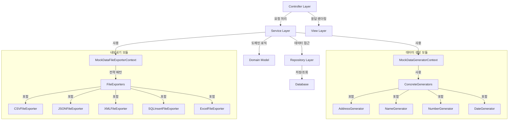
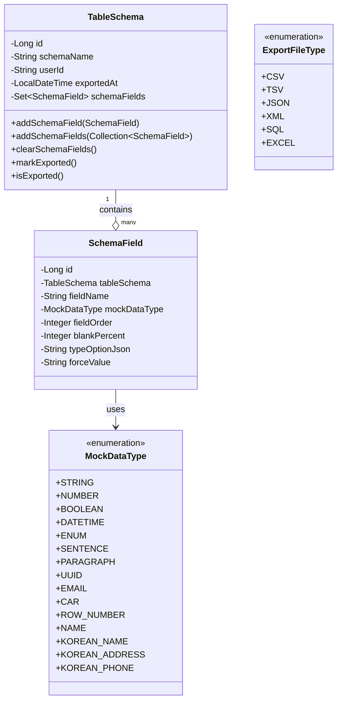
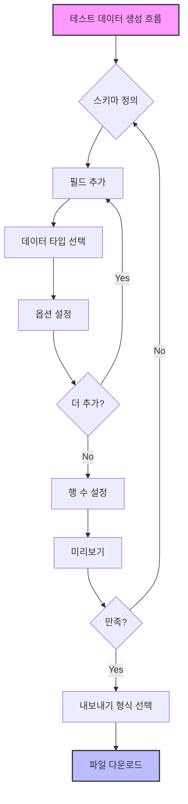

# 📊 테스트 데이터 생성기 (Test Data Generator)

<div align="center">
  
  
  
  
</div>

<div align="center">
  <a href="https://test-data-production-218bfd529fad.herokuapp.com/" target="_blank">
    
  </a>
</div>

<br>

<p align="center">
  <b>다양한 형식의 테스트 데이터를 손쉽게 생성하고 내보낼 수 있는 웹 애플리케이션</b>
</p>

## 📝 프로젝트 소개

**테스트 데이터 생성기**는 개발자와 QA 엔지니어를 위한 강력한 테스트 데이터 생성 도구입니다. 사용자 정의 스키마를 기반으로 다양한 형식(CSV, JSON, SQL, XML, Excel)의 실제같은 테스트 데이터를 자동으로 생성합니다. GitHub 계정으로 로그인하여 스키마를 저장하고 관리할 수 있으며, 다크 모드를 지원하는 모던한 UI를 제공합니다.

## ✨ 주요 기능

### 스키마 정의 및 관리

- **직관적인 스키마 빌더**: 필드 타입, 이름, 제약조건을 쉽게 설정
- **드래그 앤 드롭**: 필드 순서를 드래그로 변경 가능
- **저장 및 불러오기**: 로그인한 사용자는 스키마 저장 및 관리 가능
- **템플릿 제공**: 회원 정보, 상품 정보, 주문 정보, 주소 등 미리 정의된 템플릿

### 데이터 생성 및 내보내기

- **다중 형식 지원**: CSV, TSV, JSON, XML, SQL INSERT, Excel
- **데이터 미리보기**: 내보내기 전 데이터 샘플 확인
- **필드별 빈 값 비율 설정**: 현실적인 데이터 생성을 위한 세부 설정

### 사용자 경험

- **GitHub OAuth 로그인**: 간편한 인증
- **다크 모드 지원**: 사용자 환경에 맞는 테마 선택
- **반응형 디자인**: 모바일, 태블릿, 데스크톱 지원

## 🔢 지원하는 데이터 타입

프로젝트는 다양한 데이터 타입을 지원하여 실제와 같은 테스트 데이터 생성이 가능합니다:

### 기본 데이터 타입

- **STRING**: 설정된 길이 범위 내의 무작위 문자열 생성
- **NUMBER**: 최소/최대 범위와 소수점 자리수 설정 가능한 숫자
- **BOOLEAN**: 참/거짓 값
- **DATETIME**: 설정된 날짜 범위 내의 무작위 날짜/시간
- **ENUM**: 정의된 목록에서 무작위 선택

### 확장 데이터 타입

- **SENTENCE**: 문장 단위의 텍스트 생성
- **PARAGRAPH**: 여러 문장으로 구성된 단락 생성
- **UUID**: 고유 식별자 생성
- **EMAIL**: 유효한 이메일 주소 형식의 데이터
- **CAR**: 자동차 관련 정보 (제조사, 모델 등)
- **ROW_NUMBER**: 순차적 번호 생성 (시작값, 증가값 설정 가능)
- **NAME**: 무작위 인명 생성

### 한국어 특화 데이터 타입

- **KOREAN_NAME**: 성별 옵션을 포함한 한국인 이름 생성
- **KOREAN_ADDRESS**: 실제와 유사한 한국 주소 데이터
- **KOREAN_PHONE**: 한국 전화번호 형식의 데이터

## 📤 내보내기 형식

다양한 형식으로 데이터를 내보낼 수 있습니다:

### 파일 형식

1. **CSV/TSV**: 쉼표/탭으로 구분된 데이터 파일
2. **JSON**: 계층 구조의 데이터 형식
3. **XML**: 마크업 기반 데이터 형식
4. **SQL INSERT**: 데이터베이스 삽입 쿼리 형식
5. **Excel**: 스프레드시트 형식 (.xlsx)

각 내보내기 형식은 개별 전략 패턴으로 구현되어 있어 새로운 형식 추가가 용이합니다.

## 🛠️ 기술 스택

<table>
  <tr>
    <td>
      <strong>백엔드</strong>
    </td>
    <td>
       
       
       
      
    </td>
  </tr>
  <tr>
    <td>
      <strong>프론트엔드</strong>
    </td>
    <td>
       
       
      
    </td>
  </tr>
  <tr>
    <td>
      <strong>데이터베이스</strong>
    </td>
    <td>
       
      
    </td>
  </tr>
  <tr>
    <td>
      <strong>기타 라이브러리</strong>
    </td>
    <td>
       
       
       
      
    </td>
  </tr>
  <tr>
    <td>
      <strong>도구 및 배포</strong>
    </td>
    <td>
       
       
      
    </td>
  </tr>
</table>

## 🔍 API 구조

### 웹 엔드포인트

| 경로                                    | 메서드 | 설명                      | 인증 필요 |
| --------------------------------------- | ------ | ------------------------- | --------- |
| `/`                                     | GET    | 메인 페이지               | ❌        |
| `/table-schema`                         | GET    | 테이블 스키마 생성 페이지 | ❌        |
| `/table-schema`                         | POST   | 테이블 스키마 저장        | ✅        |
| `/table-schema/my-schemas`              | GET    | 내 스키마 목록            | ✅        |
| `/table-schema/my-schemas/{schemaName}` | POST   | 스키마 삭제               | ✅        |
| `/my-account`                           | GET    | 내 계정 정보              | ✅        |

### REST API 엔드포인트

| 경로                    | 메서드 | 설명            | 응답 형식                       |
| ----------------------- | ------ | --------------- | ------------------------------- |
| `/table-schema/export`  | GET    | 데이터 내보내기 | CSV, TSV, JSON, XML, SQL, Excel |
| `/table-schema/preview` | GET    | 데이터 미리보기 | JSON                            |

## 🏗️ 아키텍처

프로젝트는 클래식한 Spring MVC 아키텍처를 따르며, 디자인 패턴을 적극 활용하여 확장성 있는 구조로 설계되었습니다.

### 계층 구조



### 디자인 패턴

- **전략 패턴**: 다양한 파일 형식별 내보내기 전략 구현 (`MockDataFileExporter` 인터페이스)
- **컨텍스트 패턴**: 데이터 생성 및 내보내기 컨텍스트 관리 (`MockDataGeneratorContext`, `MockDataFileExporterContext`)
- **레포지토리 패턴**: 데이터 접근 추상화 (`TableSchemaRepository`)
- **DTO 패턴**: 계층간 데이터 전송 객체 활용
- **템플릿 메소드 패턴**: 데이터 생성 및 변환 과정의 공통 프레임워크 정의
- **팩토리 패턴**: 다양한 데이터 타입에 맞는 생성기 인스턴스 생성

## 💾 데이터 모델

### 클래스 다이어그램



## 📁 프로젝트 구조

```
src/
├── main/
│   ├── java/org/leedae/testdata/
│   │   ├── config/                # Spring 구성 클래스
│   │   │   └── SecurityConfig.java
│   │   ├── controller/            # MVC 컨트롤러
│   │   │   ├── MainController.java
│   │   │   └── TableSchemaController.java
│   │   ├── domain/                # 도메인 모델
│   │   │   ├── AuditingFields.java
│   │   │   ├── SchemaField.java
│   │   │   ├── TableSchema.java
│   │   │   └── constant/          # 상수 및 열거형
│   │   │       ├── ExportFileType.java
│   │   │       └── MockDataType.java
│   │   ├── dto/                   # 데이터 전송 객체
│   │   │   ├── request/
│   │   │   ├── response/
│   │   │   └── security/
│   │   ├── repository/            # 데이터 액세스 계층
│   │   │   └── TableSchemaRepository.java
│   │   └── service/               # 비즈니스 로직
│   │       ├── SchemaExportService.java
│   │       ├── TableSchemaService.java
│   │       ├── exporter/          # 파일 내보내기 구현
│   │       │   ├── CSVFileExporter.java
│   │       │   ├── JSONFileExporter.java
│   │       │   ├── MockDataFileExporter.java
│   │       │   ├── MockDataFileExporterContext.java
│   │       │   ├── SQLInsertFileExporter.java
│   │       │   ├── TSVFileExporter.java
│   │       │   ├── XMLFileExporter.java
│   │       │   └── ExcelFileExporter.java
│   │       └── generator/         # 데이터 생성 구현
│   │           ├── MockDataGenerator.java
│   │           ├── MockDataGeneratorContext.java
│   │           ├── StringGenerator.java
│   │           ├── NumberGenerator.java
│   │           ├── DateTimeGenerator.java
│   │           ├── BooleanGenerator.java
│   │           ├── NameGenerator.java
│   │           ├── EmailGenerator.java
│   │           ├── CarGenerator.java
│   │           ├── RowNumberGenerator.java
│   │           ├── KoreanNameGenerator.java
│   │           ├── KoreanAddressGenerator.java
│   │           └── KoreanPhoneGenerator.java
│   └── resources/
│       ├── static/                # 정적 자원
│       │   └── js/
│       │       └── darkmode.js    # 다크모드 기능
│       ├── templates/             # Thymeleaf 템플릿
│       │   ├── index.html
│       │   ├── my-account.html
│       │   ├── my-schemas.html
│       │   └── table-schema.html
│       ├── application.yaml       # 애플리케이션 설정
│       └── data.sql               # 초기 데이터
└── test/                          # 테스트 코드
    └── java/org/leedae/testdata/
        ├── service/
        │   ├── SchemaExportServiceTest.java
        │   ├── TableSchemaServiceTest.java
        │   ├── exporter/
        │   │   ├── CSVFileExporterTest.java
        │   │   ├── JSONFileExporterTest.java
        │   │   ├── MockDataFileExporterContextTest.java
        │   │   ├── SQLInsertFileExporterTest.java
        │   │   ├── TSVFileExporterTest.java
        │   │   ├── XMLFileExporterTest.java
        │   │   └── ExcelFileExporterTest.java
        │   └── generator/
        │       ├── MockDataGeneratorContextTest.java
        │       └── StringGeneratorTest.java
        └── controller/
```

## 📊 사용자 흐름도

테스트 데이터를 생성하기 위한 프로세스는 다음 흐름도와 같습니다:



## 🔑 핵심 구현 요소

### 1. 데이터 생성 엔진

- **Generator 인터페이스**: 각 데이터 타입별 생성 로직을 캡슐화
- **Context 클래스**: 데이터 타입에 맞는 적절한 Generator를 선택하여 호출
- **옵션 처리**: JSON 형태로 저장된 옵션을 파싱하여 생성 로직에 적용

### 2. 내보내기 엔진

- **전략 패턴**: 각 파일 형식별 내보내기 로직을 별도 클래스로 구현
- **공통 인터페이스**: 모든 내보내기 클래스가 동일한 인터페이스 구현
- **유연한 확장**: 새로운 내보내기 형식 추가가 용이한 구조

### 3. 스키마 관리

- **사용자별 스키마 저장**: 고유 제약조건으로 중복 방지
- **영속성 관리**: JPA를 활용한 효율적인 데이터 관리
- **감사 기능**: 생성/수정 시간 자동 기록

## 📈 향후 계획

- [ ] 관계형 스키마 지원 (테이블 간 관계 설정)
- [ ] 더 많은 데이터 타입 추가 (지리 데이터, 복합 타입 등)
- [ ] 스키마 공유 및 팀 협업 기능
- [ ] 대량 데이터 처리 최적화 (100만 행 이상)
- [ ] 더 많은 내보내기 형식 지원 (YAML, Protocol Buffers 등)
- [ ] 자동 데이터 검증 기능 추가
- [ ] 데이터 품질 측정 및 리포트 기능
- [ ] API 키 발급을 통한 프로그래매틱 접근 지원

## 👨‍💻 작성자

- GitHub: [@ldj4245](https://github.com/ldj4245)
